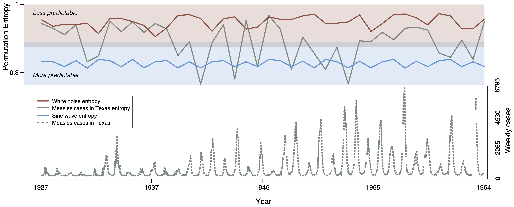

```{r setup, include=FALSE}
knitr::opts_chunk$set(echo = TRUE)
source("R Code/limits_acc_functions.R")
```

## Examining Figure 1

22 Jan 2024 


I tried to understand the code set-up by walking through the code to create Figure 1. The code snippets below are lifted from "R Code/F1.R".



My take on it is that the predictability calculation for a particular dataset, at least for Figure 1, is computed year-by-year, by only looking at the data for a single year. E.g. [for each of the example datasets](https://github.com/nickreich/infectious_disease_predictability/blob/15e913f8d1817d5c4d6349900d965ab2189199e8/R%20Code/F1.R#L45), the predictability is computed for each year separately ([link to call to the rel_ent function](https://github.com/nickreich/infectious_disease_predictability/blob/15e913f8d1817d5c4d6349900d965ab2189199e8/R%20Code/limits_acc_functions.R#L171), and [link to the rel_ent function code](https://github.com/nickreich/infectious_disease_predictability/blob/15e913f8d1817d5c4d6349900d965ab2189199e8/R%20Code/limits_acc_functions.R#L32)). 

If this understanding is correct, then the premise of Figure 1 seems not that relevant to predictability, in the sense that it isn't really capturing some long-run measure of how previous data can predict future data. Instead, it is capturing some measure of how the data varies within a specific year.


Furthermore, I tried plotting the data behind the figure for figure 1 and saw that the sin curve data used as the pinnacle of predictability didn't look right. See below how the "sine-noise" data (the original included in the paper) didn't use a periodicity that was relevant to the data. I tried to fix this by changing the period to 52 weeks. The data are plotted below (green = their sine data, purple = my sine data).

```{r}
#measles
meas <- read.csv("Data/MEASLES_Cases_1909-2001_20150923120449.csv", na.strings = "NA", header = TRUE, stringsAsFactors = FALSE)

#adding comparison time series
data <- list()
meas_TX <- meas$TEXAS[which(meas$YEAR < 1965)] #pre-vaccine
meas_TX_filt <- filt_lead_trail_NA(meas_TX)
data[["Measles-Texas"]] <- meas_TX_filt$x
years <- meas$YEAR[which(meas$YEAR < 1965)][meas_TX_filt$first:(meas_TX_filt$first+meas_TX_filt$last)]
n <- length(data[["Measles-Texas"]])
data[["noise-full"]] <- rnorm(n)
data[["noiseMissing-missing"]] <- data[["noise-full"]]
data[["noiseMissing-missing"]][which(is.na(data[["Measles-Texas"]]))] <- NA #exactly the noise model from the data
data[["sine-noise"]] <- sin(1:n) + rnorm(n, 0, 0.001)
data[["sine-noise-52w"]] <- sin((1:n)/(52/(2*pi))) + rnorm(n, 0, 0.001)


## explore data
par(mfrow=c(5,1), mar=c(2,2,.5,1))
plot(data[["Measles-Texas"]], type="l")
plot(data[["noise-full"]], type="l", col="red")
plot(data[["noiseMissing-missing"]], type="l", col="blue")
plot(data[["sine-noise"]], type="l", col="green")
plot(data[["sine-noise-52w"]], type="l", col="purple")

```

These data then produce quite different results in terms of annual permutation entropy computed using their functions. Notice how the published figure shows what in the figure below is the green line as the "reference of predictability". However, if we change that reference to be a sine curve with periodicity of one year (52 weeks) then the entropy is quite a bit lower, and much further away from the data.

```{r}
########
#Params#
########
window <- 52 #10 times 3!, which is greatest dimension allowed

##########
#Analysis#
##########
results <- list()
plot_data <- list()
pb <- txtProgressBar(1, length(data), style=3)
for(i in 1:length(data)){
  x.i <- data[[i]]
  
  fit.i <- full_lenth_pred_window(data = x.i, start = 1, end = length(x.i), window = window, d_1 = 2, d_2 = 5)
  
  results[[names(data)[i]]] <- fit.i
  plot_data[[names(data)[i]]] <- x.i
}

##########
#Plotting#
##########
cols <- c("black", "red", "blue", "green", "purple")
par(mfrow=c(1,1), mar = c(3,4,4,3))
for(i in 1:length(data)){
  plot(results[[i]]$results$raw.perm.entropy, 
       type = "l", 
       #yaxt = "n", 
       xaxt = "n", 
       ylim = c(0,1), 
       lwd = 3, 
       col = cols[i], 
       bty = "n", 
       xlab = "", 
       ylab = "permutation entropy"
       )
  if(i != length(data)) par(new = TRUE)
}

at.x <- seq(0, 
            length(results[[i]]$results$raw.perm.entropy), 
            length.out = 5)
at.y.z <- seq(0, length(results[[i]]$results$raw.perm.entropy),
              length.out = 4)
yrs <- round(seq(min(years, na.rm=TRUE), max(years, na.rm=TRUE), 
                 length.out = length(at.x)))
axis(1, at = at.x, 
     labels = yrs)
legend(0, .3, legend = names(data), 
       col = cols, lwd = 3, 
       lty = c(1,1,1,1,1), 
       bty = "n")

```

Even more fundamentally, I'm not convinced that the permutation entropy tells us about the short-term predictability if it is just looking at information from one year, in isolation of the other years. I guess it's possible that the other figures look at more of the data? 
